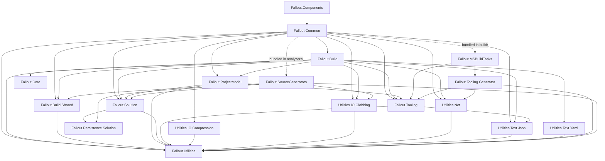

# Architecture

Canonical reference for how the Fallout repo is laid out, what each project does, and how the packages depend on each other.

## Top-level layout

```
.
├── .agents/, .claude/        Skills and settings for AI coding tools
├── .assets/                  Logos and social-preview images (PNG + SVG)
├── .config/                  dotnet-tools.json (pins the `fallout` global tool used by CI)
├── .fallout/                 Build orchestrator runtime state (committed: schema, parameters)
├── .github/                  GitHub Actions workflows, Dependabot config, issue/PR templates
├── .packageguard/            PackageGuard policy (allowed licenses)
├── build/                    The build orchestrator project (consumes Fallout itself — dogfooding)
│   ├── _build.csproj
│   └── Build.*.cs            Partial classes split by concern (CI, Licenses, PackageGuard, etc.)
├── docs/                     Documentation site content (docs/website) + architecture notes (this file)
├── src/                      All production projects
│   ├── Fallout.<X>/          One folder per project
│   ├── Persistence/          Fallout.Solution + Fallout.Persistence.Solution (.sln/.slnx support)
│   └── Shims/                Nuke.* transition shims
├── tests/                    All test projects
│   ├── Fallout.<X>.Specs/    Unit and snapshot tests, one per tested project
│   ├── Consumers/            Smoke-test projects that consume Fallout like a real user would
│   ├── Benchmarks/           BenchmarkDotNet projects
│   └── integration/          docker-compose setup for integration tests
├── tools/                    Maintainer scripts (for example unlisting NuGet versions)
├── AssemblyInfo.cs           Shared InternalsVisibleTo declarations (included by Directory.Build.props)
├── Directory.Build.props     Shared MSBuild properties + ItemGroups applied to every project
├── Directory.Build.targets   Smart PackageReference → ProjectReference logic, NBGV CI fix
├── Directory.Packages.props  Central package version management — never put Version= inline
├── fallout.slnx              Solution file (new XML format, not .sln)
├── global.json               Pinned .NET SDK
├── version.json              Nerdbank.GitVersioning config
├── nuget.config              Restricts package sources to nuget.org with explicit mapping
└── build.{ps1,sh}            Bootstrap entry points
```

## Why the layout looks like this

### `src/` vs `tests/` split

Production code and tests live in separate top-level directories so:

- Project filters in IDEs map cleanly to "what ships" vs "what verifies."
- CI can target `tests/**` patterns without writing per-project exclusions.
- `IsPackable` is name-based: projects whose name ends in `Tests` or `Specs` are never packed. No manual opt-out per project.

The previous monorepo style under `source/` mixed both, and `source/Directory.Build.props` had to special-case the test projects. After the split, the split is structural.

### `.assets/` for binary content

Images, logos, and other non-code binary content live under `.assets/`. The leading dot keeps it out of most CI path filters and signals "not source." There is no package icon yet: NuGet does not accept SVG, and the `PackageIcon` lines in `Directory.Build.props` stay commented out until a 256×256 PNG exists.

### `build/` consumes the rest of the repo (dogfooding)

`build/_build.csproj` references `src/Fallout.Components`, `src/Fallout.Tooling.Generator`, and `src/Fallout.SourceGenerators` (as an analyzer). Any change to the framework can be exercised by running `./build.ps1`. If the build itself breaks, you notice immediately. `_build.csproj` turns central package management off, so its few package versions are inline.

### Shared build files hoisted to root

`Directory.Build.props` and `AssemblyInfo.cs` live at the repo root rather than under `src/` or `tests/`. Both `src/<Project>/` and `tests/<Project>/` projects need to inherit them, and MSBuild's directory walk finds them once at the root without per-tree duplication.

## Projects under `src/`

"Ships to" says who receives the project:

- **Library**: a NuGet package that build projects reference, directly or through `Fallout.Common`.
- **Bundled**: not a package dependency. Its DLLs are copied *inside* the `Fallout.Common` package (see [What `Fallout.Common` bundles](#what-falloutcommon-bundles)).
- **Tool**: a .NET global tool, which runs in its own process.

| Project | Package id | Ships to | Target frameworks | What it does |
|---|---|---|---|---|
| `Fallout.Core` | `Fallout.Core` | Library | netstandard2.1, net10.0 | Pure domain types and graph algorithms of the build pipeline. No I/O, no logging, no references to other projects. |
| `Fallout.Utilities` | `Fallout.Utilities` | Library | netstandard2.0, net10.0 | Base helpers: `AbsolutePath`, string, collection and IO extensions, `Assert`. No third-party dependencies. |
| `Fallout.Utilities.IO.Compression` | same | Library | netstandard2.0 | `ZipTo`, `UnZipTo`, `TarGZipTo` and friends, built on SharpCompress. |
| `Fallout.Utilities.IO.Globbing` | same | Library | netstandard2.0 | `GlobFiles` / `GlobDirectories`, built on Glob. |
| `Fallout.Utilities.Net` | same | Library | netstandard2.0 | HTTP download helpers. |
| `Fallout.Utilities.Text.Json` | same | Library | netstandard2.0 | JSON read/write helpers on `AbsolutePath`. |
| `Fallout.Utilities.Text.Yaml` | same | Library | netstandard2.0 | YAML helpers (`ToYaml`, `GetYaml`, `WriteYaml`), built on YamlDotNet. |
| `Fallout.Build.Shared` | same | Library | netstandard2.0, net10.0 | Types shared by the build runtime and the source generator (attributes, CI configuration models). |
| `Fallout.Persistence.Solution` | same | Library | netstandard2.0, net8.0, net10.0 | Parser for `.sln` / `.slnx` files. Originally Microsoft's `SolutionPersistence` library (MIT), now owned by Fallout. Mostly `internal`. |
| `Fallout.Solution` | same | Library | netstandard2.0, net10.0 | Public API over that parser: `Solution`, `Project`, `SolutionFolder`. |
| `Fallout.Tooling` | same | Library | netstandard2.0, net10.0 | Runtime for tool wrappers: tool settings, running processes, resolving NuGet packages. |
| `Fallout.ProjectModel` | same | Library | net8.0, net9.0, net10.0 | Loads `.csproj` files through MSBuild (`ParseProject`, `GetMSBuildProject`). Uses MSBuildLocator to load the MSBuild of the installed SDK at runtime. |
| `Fallout.Build` | same | Library | net10.0 | The build engine: `FalloutBuild`, targets, parameters, execution, logging, CI/CD attributes. |
| `Fallout.Common` | same | Library | net10.0 | The main package build projects reference: generated tool wrappers, CI integrations, Git/GitHub, Azure Key Vault, ChangeLog, value-injection attributes. Also ships the MSBuild props/targets, the MSBuild tasks and the source generator. |
| `Fallout.Components` | same | Library | net10.0 | Reusable build interfaces: `ICompile`, `IPack`, `ITest`, `ICreateGitHubRelease`, and so on. |
| `Fallout.Tooling.Generator` | same | Bundled (also packed on its own) | netstandard2.0 | Generates the tool-wrapper `.cs` files from `Tools/<Tool>/<Tool>.json`. Runs in this repo's build and inside `Fallout.MSBuildTasks`. |
| `Fallout.MSBuildTasks` | — (not packable) | Bundled | net10.0, net472 | MSBuild tasks that run during the consumer's `dotnet build`. The net472 copy runs inside Visual Studio's MSBuild. |
| `Fallout.SourceGenerators` | — (not packable) | Bundled | netstandard2.0 | Roslyn source generators: strongly typed solution/project access, CI configuration, transition shims. Pinned to Roslyn 4.7.0 so older compilers can load it. |
| `Fallout.Cli` | `Fallout.GlobalTool` | Tool (`fallout`) | net10.0 | The `fallout` global tool: set up, run and update builds, convert Cake scripts. |
| `Fallout.Migrate` | `Fallout.Migrate` | Tool (`fallout-migrate`) | net10.0 | Migrates a NUKE repository to Fallout in one command. |
| `Fallout.Migrate.Analyzers` | `Fallout.Migrate.Analyzers` | Analyzer package | netstandard2.0 | Roslyn analyzer and code fix that rewrites `Nuke.*` namespaces to `Fallout.*`. Used only while migrating. |
| `Nuke.Build`, `Nuke.Common`, `Nuke.Components` | same | Library (GitHub Packages only) | net10.0 | Transition shims: types under the old `Nuke.*` names that forward to the `Fallout.*` types, for projects that are halfway through migrating. |

Not every project has its own `Specs` project. `Fallout.Utilities.Specs` covers several Utilities packages. `Fallout.Build.Shared`, `Fallout.MSBuildTasks`, `Fallout.Tooling.Generator`, `Fallout.Utilities.IO.Globbing`, `Fallout.Utilities.Net`, `Fallout.Persistence.Solution` (benchmarks only) and `Nuke.Build` have no dedicated tests.

## Package graph

How `Fallout.Components` and `Fallout.Common` pull in the other Fallout packages. Solid arrows are NuGet package dependencies. Dotted arrows are DLLs bundled *inside* the `Fallout.Common` package.



`Fallout.Cli`, `Fallout.Migrate`, `Fallout.Migrate.Analyzers` and the `Nuke.*` shims are not part of this graph. A build project only gets them if it asks for them.

Central package management has transitive pinning turned on (`CentralPackageTransitivePinningEnabled`). Because of that, the `.nuspec` of `Fallout.Common` and `Fallout.Components` lists **every** third-party package in the graph as a direct dependency, not just the Fallout packages. See [dependencies.md](dependencies.md#updating-dependencies) for what that means for version updates.

### What `Fallout.Common` bundles

Bundled DLLs are not package dependencies. Consumers cannot see or override their versions, but they run inside the consumer's own processes:

| Folder in the package | Contents | Runs in |
|---|---|---|
| `build/` | `Fallout.Common.props` / `.targets` | The consumer's MSBuild |
| `build/netcore/` | `Fallout.MSBuildTasks` + `Tooling.Generator`, `Tooling`, `Utilities*`, plus NuGet.*, Serilog, HtmlAgilityPack, Humanizer (with its resource folders), Newtonsoft.Json | `dotnet build` (MSBuild on .NET) |
| `build/netfx/` | The same, plus .NET Framework copies of System.Text.Json, System.Memory, System.Collections.Immutable and other System.* DLLs | Visual Studio's MSBuild (.NET Framework) |
| `analyzers/dotnet/cs/` | `Fallout.SourceGenerators` + `Build.Shared`, `Solution`, `Persistence.Solution`, `Utilities`, `Utilities.IO.Globbing`, Scriban | The C# compiler (Roslyn) |

These DLLs must load next to the versions that MSBuild, Visual Studio or Roslyn already loaded. For example, `NuGet.Packaging` was raised to 7.9.0 in #677 (the NuGet/SDK version mismatch) because the .NET 10.0.400 SDK loads `NuGet.Frameworks` 7.9 into MSBuild.

## Engine internals

This file covers *layout*. For how the build orchestrator works inside — the static-state model, the god class, and the `[Foundation]` de-statification epic that reshapes it (with as-is / to-be diagrams) — see [engine-de-statification.md](engine-de-statification.md).

## Build conventions

- **Central package versions.** All `PackageReference` versions live in `Directory.Packages.props`. Never inline `Version=` on a `PackageReference` — the build will error. Don't bypass this or `Directory.Build.targets` with project-local overrides. The exceptions are `build/_build.csproj` and `tests/Consumers/Fallout.Consumer.NuGet`, which turn central package management off on purpose.
- **Smart `PackageReference`.** `Directory.Build.targets` rewrites `PackageReference`s that match a project in `fallout-global.sln` into `ProjectReference`s. It only does something when that file exists, and nothing in the current build creates it, so in a normal build it has no effect.
- **`AssemblyInfo.cs` at root.** Shared `InternalsVisibleTo` declarations. Included automatically via `Directory.Build.props`.
- **No per-file license headers.** The MIT notice lives in [`LICENSE`](https://github.com/Fallout-build/Fallout/blob/develop/LICENSE) at the repo root. NuGet packages declare MIT via `PackageLicenseExpression` in `Directory.Build.props`. Code under `src/Persistence/Fallout.Persistence.Solution/` that came from Microsoft keeps its own headers — leave those alone.
- **Don't reintroduce `source/` or `images/`.** Production code lives under `src/`, tests under `tests/` (see the split rationale above); binary assets live under `.assets/`.
- **Don't commit build output.** No `output/`, `bin/`, `obj/`, or generated `fallout-global.*` files.

## CI layout

| Workflow | When it runs | What it does |
|---|---|---|
| `build.yml` (generated) | Every PR targeting `develop`, `main`, `release/*`, or `support/*` (with `paths-ignore` for docs/.assets/markdown) | `VerifyGeneratedTools`, `VerifyLlmsTxt`, `Test`, `Pack` and `PackageGuard` (license policy check) on Linux. The job `ubuntu-latest` is the only required status check. |
| `build-skip.yml` | Docs-only PRs to the same branches | Reports the `ubuntu-latest` check so docs-only PRs aren't blocked, and runs `VerifyLlmsTxt`. |
| `build-cross-platform.yml` (generated) | PRs targeting `main`, `release/*` or `support/*`, and `v*` tag pushes | Test + Pack on macOS **and** Windows (one job each). Gated to release intent. |
| `security-scan.yml` (generated) | Push to `develop`, `main`, `release/*` or `support/*` | Runs PackageGuard and uploads its SARIF risk report to GitHub code scanning. |
| `publish-packages-preview.yml` | Push to `develop` | Test + Pack + publish `-preview` packages to GitHub Packages only. |
| `publish-packages-release.yml` | `v*` tag push on a production branch (or `workflow_dispatch`) | Test + Pack + publish to GitHub Packages + GitHub Releases (nuget.org opt-in). |
| `prune-preview-packages.yml` | Mondays 03:00 UTC (or `workflow_dispatch`) | Deletes old `-preview` versions from GitHub Packages, which has no retention policy of its own. |

Linux runs on every PR because it's cheap and fast. macOS and Windows only run for release intent (PRs to `main`, release and support branches, and release tags) to save CI minutes. If cross-platform breaks, it shows on a release PR or tag and we fix it before shipping.

## What this doc deliberately does NOT cover

- API design decisions inside individual projects — read the project's tests for those.
- Third-party packages and whether they are safe to update — see [dependencies.md](dependencies.md).
- Rebrand status and migration strategy — see `AGENTS.md` and the [Fallout rebrand milestone](https://github.com/Fallout-build/Fallout/milestone/1).
- Contribution workflow — see `CONTRIBUTING.md`.

When in doubt, the structure is whatever this file says it is. If you change the layout, update this file in the same PR.
